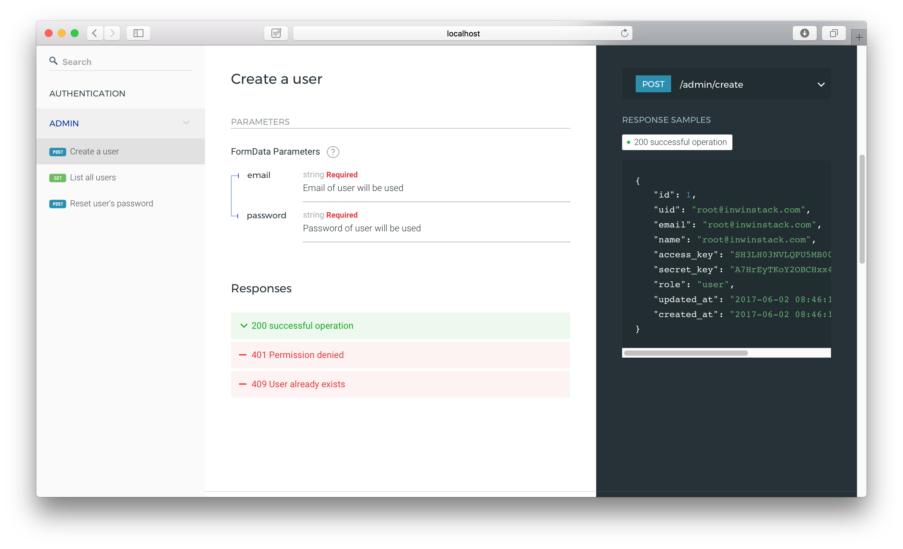

# S3 Portal API
[](https://travis-ci.org/Ci-Jie/s3-portal-api)

S3 Portal API is an open source system for providing basic on Ceph radosgw and Amazon AWS SDK APIs.

On the other hand, the developers can use S3 Portal API for furter development like [S3 Portal](https://github.com/inwinstack/s3-portal-ui).

## Quick Start

Following the below steps to build S3 Portal API

Requirements :

* `php >= 5.5.9`

First, copy `.env.example` and name it as `.env` :

```sh
$ cp .env.example .env
```

> `.env` is the environment variable file defined by Laravel.

And then set the environment variables in `.env`, for example :

```
...

DB_HOST=<DB_HOST>
DB_DATABASE=<DB_DATABASE>
DB_USERNAME=<DB_USERNAME>
DB_PASSWORD=<DB_PASSWORD>

...

S3_ACCESS_KEY=<S3_ACCESS_KEY>
S3_SECERT_KEY=<S3_SECERT_KEY>
REGION=default
S3_URL=<S3_URL>
S3_ADMIN_ENRTYPOINT=<S3_ADMIN_ENRTYPOINT>
S3_PORT=7480
CEPH_REST_API_URL=<CEPH_REST_API_URL>
CEPH_REST_API_PORT=5000
USER_DEFAULT_CAPACITY_KB=-1
```

> The `DB_HOST`, `DB_DATABASE`, `DB_USERNAME` and `DB_PASSWORD` can be set according to your environment.
> And then `S3_ACCESS_KEY` and `S3_SECERT_KEY` account must be admin caps in rgw.

Finally, install according to dependency packages :

```sh
$ composer install
```

In order for the system to perform and enhance security, use below command to generate Application Key :

```sh
$ php artisan key:generate
```

And then, generate JWT key that provides user authentication for use :

```sh
$ php artisan jwt:generate
```

## Documentation

S3 Portal API provider the API documentation of online version, we use swagger to develop, but it is in alpha that not include all, so not recommend to watch in currently.

You can input `http://localhost/document` in browser if your S3 Portal API is use 80 port.


